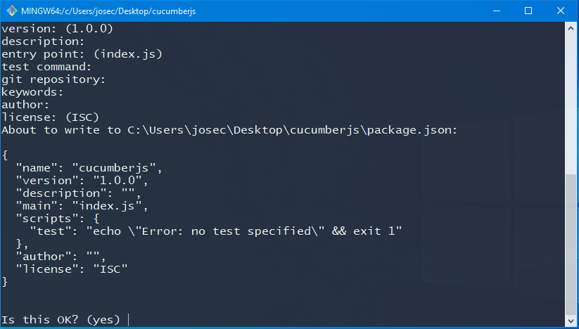
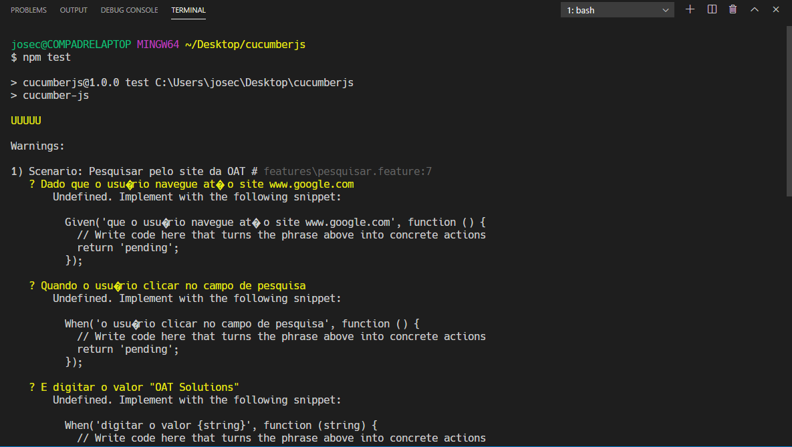

<p align="center">
  <a href="" rel="noopener">
 </a>
</p>

<h3 align="center">Tutorial Cucumber.js e selenium-cucumber-js</h3>

<div align="center">

[]()
[](/LICENSE)

</div>

---

<p align="center">Um tutorial rápido para colocar o cucumber.js para funcionar.
    <br> 
</p>

## 📝 Table of Contents

- [Sobre](#about)
- [Início](#getting_started)
- [Instalação](#instalation)
- [Utilização](#usage)
- [Built Using](#built_using)
- [Autores](#authors)
- [Agradecimentos](#acknowledgement)

## 🧐 Sobre <a name = "about"></a>

Esse tutorial irá auxiliar a criar testes e executa-los utilizando o Cucumber.js

## 🏁 Início <a name = "getting_started"></a>

Siga os passos abaixo para instalar o Cucumber.js

### Pre-requisitos

Para executar esse tutorial é necessário ter instalado o Node.js versão 6 ou superior. 
Você pode baixar o Noje.js do link https://nodejs.org/en/

### Componentes

Esse tutorial usa os seguintes componentes:
* **chromedriver**: o selenium-webdriver usa esse componente executável para automação do browser. 
* **selenium-webdriver**: disponibiliza uma api para executar comandos no browser. 
* **cucumber**: é o framework de testes que interpreta especificações em liguagem humana transformando em código de teste executável. 
* **chai**: é a api de _assersion_ que permite comparar os resultados obtidos com o resultado esperado. 
* **chai-as-expected**: permite realizar assersion de maneira assíncrona. 

### Instalando <a name = "instalation"></a>

Baixe o chromedriver correspondente à versão do Chrome na sua máquina através do link https://chromedriver.chromium.org/downloads 

Descompacte o chromedriver em um local da sua máquina e configure a variável Path do Windows para apontar para o local definido. Por exemplo, c:\chromedriver. 

Crie uma pasta local para o projeto de teste. Por exemplo, c:\cucumberjs

Acesse a pasta criada.

Exemplo: 
```
cd cucumberjs
```

Na linha de comando do windows digite o comando abaixo:
```
npm init
```

Responda às perguntas do npm init ou simplesmente pressione enter até ele pedir a confirmação. 



Instale os componentes através do comando abaixo:

```bash 
npm install --save-dev chromedriver selenium-webdriver cucumber chai chai-as-promised
```

## 🎈 Utilização <a name="usage"></a>

Crie um estrutura de pastas conforme a indicação abaixo:

features <br />
└steps_definition<br />
└support <br />

Dentro da pasta features, crie um arquivo com extensão .feature e com o nome da funcionalidade a ser testada. Por exemplo, **pesquisa.feature**.

Abra o arquivo em um editor de texto como Notepad, Notepad++, EditPlus ou VisualStudio Code.

Caso esteja no Linux ou GitBash digite

```bash
vim pesquisa.feature
```

Escreva a especificação de teste, em sintaxe Gherkin, como no exemplo abaixo:

```gherkin 
Feature: Pesquisar no Google
  Para pode encontrar o resultado pesquisado
  Como um usuário
  Eu quero poder pesquisar por termos no site Google

  Scenario: Pesquisar pelo site da OAT
    Given que o usuário navegue até o site www.google.com
    When o usuário clicar no campo de pesquisa
    And digitar o valor "OAT Solutions"
    And pressionar enter
    Then o site da OAT deverá ser exibido na lista de resultados
```

Se quise usar a sintaxe em Portugês, escreva no formato abaixo:

```gherkin
# language: pt
Funcionalidade: Pesquisar no Google
  Para pode encontrar o resultado pesquisado
  Como um usuário
  Eu quero poder pesquisar por termos no site Google

  Cenario: Pesquisar pelo site da OAT
    Dado que o usuário navegue até o site www.google.com
    Quando o usuário clicar no campo de pesquisa
    E digitar o valor "OAT Solutions"
    E pressionar enter
    Entao o site da OAT deverá ser exibido na lista de resultados
```

Salve o arquivo. 

Na pasta support crie o arquivo **world.js** e escreva o código abaixo:

```javascript
const webdriver = require('selenium-webdriver');
const By = webdriver.By;
const until = webdriver.until;

var { setWorldConstructor, setDefaultTimeout } = require('cucumber');

setDefaultTimeout(20 * 1000);

function CustomWorld(callback) {
  this.driver = new webdriver.Builder().forBrowser('chrome').build();
}

setWorldConstructor(CustomWorld);
```

Salve o arquivo. 

Abra o arquivo package.json e inclua a linha **"test": "cucumber-js"** dentro da propriedade **"scripts"** como no exemplo abaixo:

```json
...
  },
  "devDependencies": {
    "chromedriver": "^79.0.3"
  },
  "scripts": {
    "test": "cucumber-js"
  },
  "author": "",
  "license": "ISC"
...
```

Salve o arquivo.

Na linha de comando, mude para o diretório features e execute o comando abaixo:

```bash
npm test
```

O cucumber irá informar que encontrou cenários de testes porém sua implementação está indefinida. Portanto o console exibirá a mensagem UUUUU, ou seja, existem cinco passos de teste sem implementação.

Veja o exemplo abaixo:



Copie os passos que o cucumber indicou que estão ausentes para o arquivo stepdefs.js dentro da pasta  steps_definition. O arquivo deve conter o código abaixo:

```javascript 
Given('que o usuário navegue até o site www.google.com', function () {
  // Write code here that turns the phrase above into concrete actions
  return 'pending';
});
When('o usuário clicar no campo de pesquisa', function () {
  // Write code here that turns the phrase above into concrete actions
  return 'pending';
});
When('digitar o valor {string}', function (string) {
  // Write code here that turns the phrase above into concrete actions
  return 'pending';
});
When('pressionar enter', function () {
  // Write code here that turns the phrase above into concrete actions
  return 'pending';
});

Then('o site da OAT deverá ser exibido na lista de resultados', function () {
  // Write code here that turns the phrase above into concrete actions
  return 'pending';
});

```
O cucumber indica o local no código para implementar a automação. Para realizar a automação faremos chamadas a API do Selenium e usaremos o Chai para facilitar a validação do resultado de uma maneira que fique mais legível. Para simplificar esse tutorial simplesmente altere as linhas para ficar igual ao código abaixo. 

```javascript
const { Given, When, Then, Before } = require('cucumber');
const webdriver = require('selenium-webdriver');
const By = webdriver.By;
const chai = require('chai');
const chaiAsPromised = require('chai-as-promised');
chai.use(chaiAsPromised);
const expect = chai.expect;
const until = webdriver.until;
const Key = webdriver.Key;

Given('que o usuário navegue até o site www.google.com', function () {
  return this.driver.get('http://www.google.com');
});
When('o usuário clicar no campo de pesquisa', function () {
  return this.driver.findElement(By.name('q')).click();
});
When('digitar o valor {string}', function (string) {
  return this.driver.findElement(By.name('q')).sendKeys('OAT Solutions');
});
When('pressionar enter', function () {
  return this.driver.findElement(By.name('q')).sendKeys(Key.ENTER);
});

Then('o site da OAT deverá ser exibido na lista de resultados', function () {
  return expect(this.driver.findElement(By.xpath('/html/body/div[7]/div[3]/div[9]/div[1]/div[2]/div/div[2]/div[2]/div/div/div[1]/div/div/div/div/div[1]/a')).getAttribute('href'))
    .to.eventually.contain('http://www.oatsolutions.com.br/');
});
```
Agora execute o comando abaixo:

```bash
npm test
```

🍾 Parabéns!

## ⛏️ Construido com <a name = "built_using"></a>

- [Visual Studio Code](https://www.mongodb.com/) - Database
- [NodeJs](https://nodejs.org/en/) - Node.js Framework
- [Cucumber](https://cucumber.io/) - Cucumber BDD Framework
- [Cucumberjs](https://github.com/cucumber/cucumber-js) - Cucumber Framework for Node.js
- [Selenium Webdriver](https://www.npmjs.com/package/selenium-webdriver) - Selenium API for Node.js

## ✍️ Authors <a name = "authors"></a>

- [@compadrejunior](https://github.com/compadrejunior) - OAT Solutions


## 🎉 Agradecimentos <a name = "acknowledgement"></a>

- Time BrMalls
- Samanta Aragão
- Alvaro D'Alessandro
